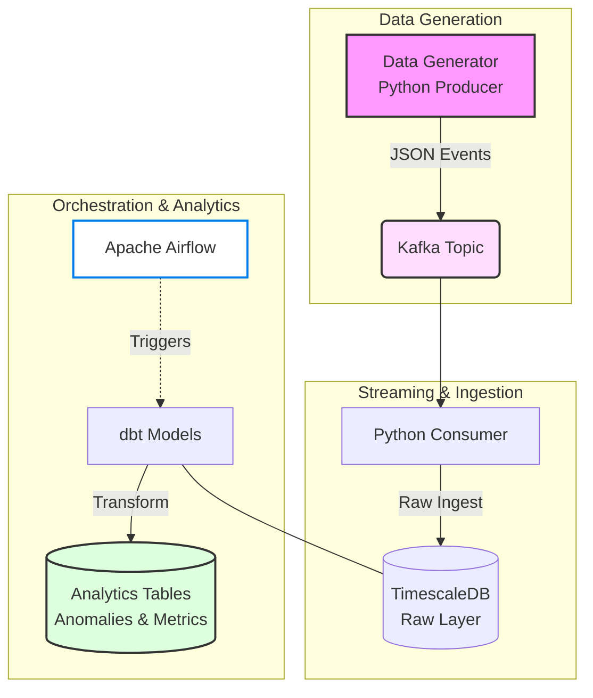

# 🚀 Machine Health Monitoring Pipeline

## Overview

This project implements a real-time data engineering pipeline for monitoring machine health using streaming data.

The pipeline simulates IoT sensor data, streams it through Kafka, ingests it into a time-series database, and applies SQL-based anomaly detection using dbt.

It demonstrates modern data engineering practices including streaming, time-series storage, transformation layers, and orchestration.

---

## Architecture



## Features
* Real-time streaming pipeline using Kafka
* Time-series storage using TimescaleDB hypertables
* SQL-based anomaly detection using window functions
* Rolling metrics for machine monitoring
* Layered data modeling with dbt (staging → intermediate → marts)
* Workflow orchestration with Airflow
* Simulated IoT data generation 

## Data Model
# Raw Table: machine_readings
* machine_id
* timestamp
* temperature
* vibration
* pressure

# Final Table: mart_anomalies
* machine_id
* timestamp
* temperature
* rolling_temp_avg
* is_anomaly
* anomaly_type

## Anomaly Detection Logic

Anomalies are detected using:

* Threshold-based logic (e.g., temperature > 90°C)
* Rolling average comparison using SQL window functions

Example:
temperature > rolling_temp_avg * 1.5

## How to Run
### 1. Start infrastructure

```bash
docker compose up -d
```
### 2. Run data producer
 ```bash
python data_generator/producer.py
```
### 3. Run Kafka consumer
```bash
python ingestion/consumer.py
```
### 4. Run dbt transformations
```bash
cd machine_health_dbt
dbt run
```
### 5. Start Airflow
* **URL:** [http://localhost:8081](http://localhost:8081)
* **Username:** `admin`
* **Password:** `admin`

## Key Learnings
* Designing real-time streaming pipelines
* Working with time-series databases (TimescaleDB)
* Implementing anomaly detection using SQL window functions
* Using dbt for modular data transformations
* Orchestrating pipelines with Airflow
* Building production-like systems with Docker

Author

Seyfemichael Araya
📍 Berlin, Germany
🔗 LinkedIn: https://www.linkedin.com/in/seyfemichael-araya-a82290288/
